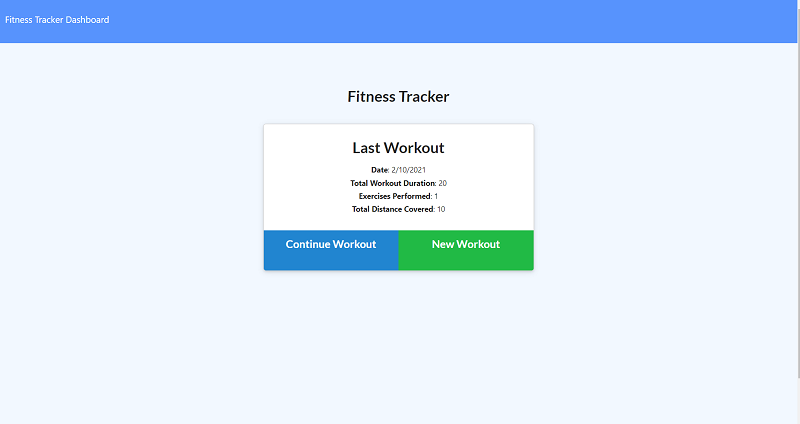
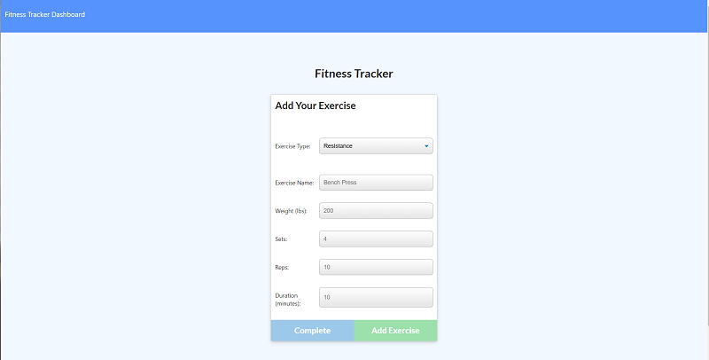
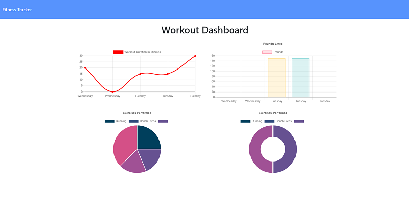

# Workout-Tracker (Workout Tracker - NoSQL)
## Description
The Workout Tracker application allows users to create and track their daily workouts.
As part of U of T SCS Coding Bootcamp Homework assignment, front end code was already provided. The assignment was to create MongoDB database with a Mongoose schema and handle routes with Express. The application has been deployed on Heroku using MongoDB Atlas as the database.
- Link to the application on Heroku: https://limitless-ridge-59089.herokuapp.com/
- Link to the GitHub repository: https://github.com/nagck/workout-tracker/

## User Story
* As a user, I want to be able to view create and track daily workouts. I want to be able to log multiple exercises in a workout on a given day. I should also be able to track the name, type, weight, sets, reps, and duration of exercise. If the exercise is a cardio exercise, I should be able to track my distance traveled.

The user should be able to:
  * Add exercises to the most recent workout plan.
  * Add new exercises to a new workout plan.
  * View the combined weight of multiple exercises from the past seven workouts on the `stats` page.
  * View the total duration of each workout from the past seven workouts on the `stats` page.

## Technologies Used: 
* Node.js, Express
* MongoDB NoSQL database
* Mongoose Object Data Modeling (ODM) library for MongoDB and Node.js
* JavaScript, CSS, HTML
* npm 

## Installation

1. To install this code, download the zip file and extract the files to a designated directory on your node.js server without changing the directory/folder structure, or use GitHub's guidelines to clone the repository. 
2. Once the code is extracted, navigate to the project directory and execute 'run npm install' command to install node.js and related dependencies.
3. Update MongoDB connection information to point to your instance of MongoDB.

Also, the application is currently hosted on Heroku and you can access it at 
https://limitless-ridge-59089.herokuapp.com/

## Usage 
The application can be invoked by using the following command and follow the instructions after that:

```bash
node server.js
```
Point your browser to http://localhost:3000/ to start using the application.  
## Screenshots of the application:
Main page of the application:



Adding Exercise Screen:



Dashboard showing details of past 7 workouts.




## Link to functional application deployed on Heroku:

https://limitless-ridge-59089.herokuapp.com/

## Credits

- The application has been developed using JavaScript, Node.js, Express, MongoDB, Mongoose. 

- Sincere thanks to my course instructors Ed (Edward Apostol), Herman (German Arcila) and Anas (Anas Qazi) for teaching and helping me in acquiring HTML/CSS/JavaScript/Node.js/MongoDB/Mongoose skills. And of course thanks to my fellow students for sharing valuable tips and tricks on Slack study groups.

- Here are some websites that I referred to develop the code:
* https://www.mongodb.com/
* https://mongoosejs.com/
* https://www.npmjs.com/
* https://www.npmjs.com/package/express
* https://www.w3schools.com/nodejs/
* https://developer.mozilla.org/en-US/docs/Web/JavaScript
* https://www.w3schools.com/js/default.asp

## License
Licensed under the [MIT](https://choosealicense.com/licenses/mit/) license.<br>
<br />
## Feedback
Feedback is always appreciated. If you are interested in fixing any issues and contributing directly to the code base, please provide at:
- GitHub Pull Requests: [https://github.com/nagck/workout-tracker/pulls](https://github.com/nagck/workout-tracker/pulls)
- GitHub: [https://github.com/nagck](https://github.com/nagck)

---